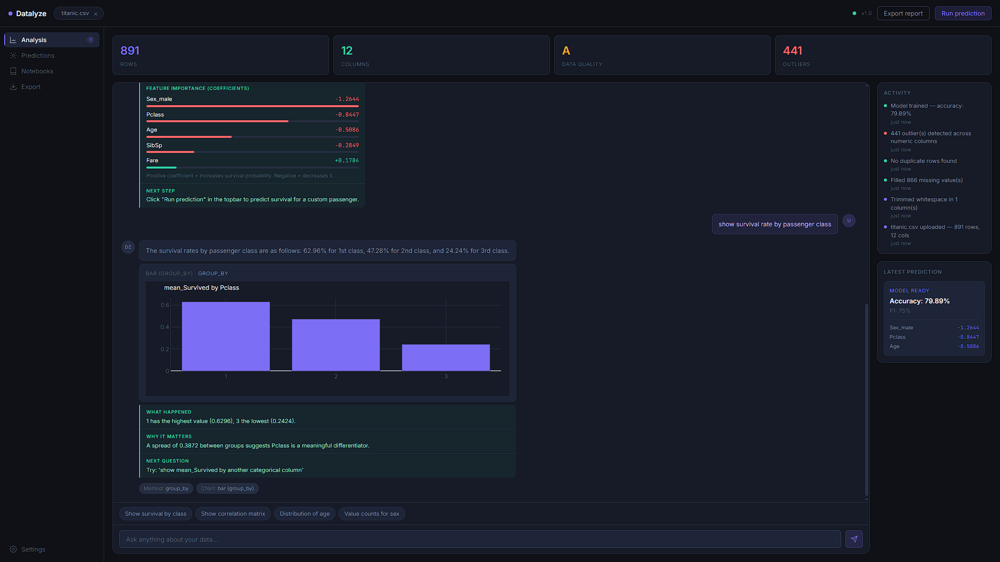
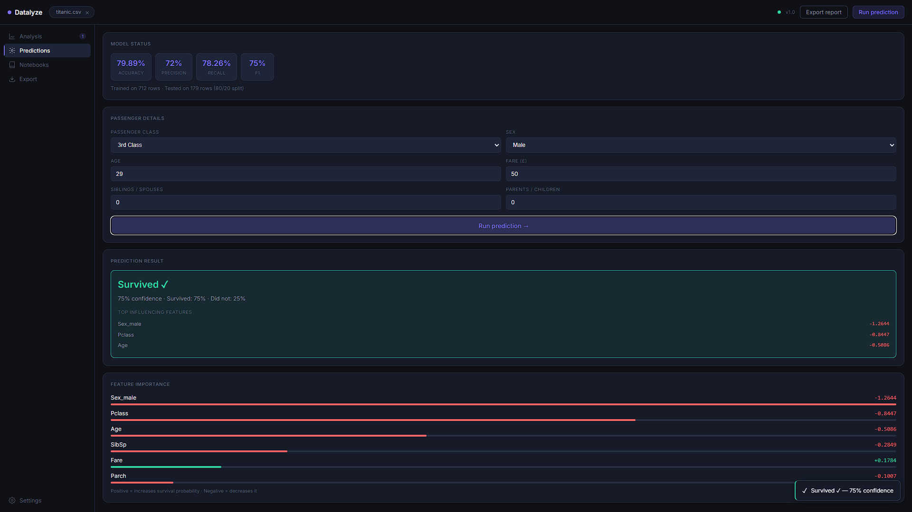

<div align="center">

# Datalyze

**An end-to-end data analysis platform — upload a dataset, ask questions in plain English,
get charts, outlier detection, ML predictions, and AI-powered insights.**

[](https://swap9035.github.io/datalyze/)
[](https://datalyze-api.onrender.com/health)
[](https://github.com/Swap9035/datalyze)

</div>

---

## Live Demo

🔗 **[swap9035.github.io/datalyze](https://Swap9035.github.io/datalyze/)**

> ⚠️ First load may take 30–50 seconds — Render free tier spins down after inactivity.
> Refresh once if the health dot stays red.

---

## What it does

Upload any CSV, Excel, or JSON dataset and get:

- **Automated data cleaning** — null imputation (median/mode), deduplication,
  type coercion with a documented change report
- **Descriptive statistics** — per-column mean, median, percentiles, skewness,
  top categories, date ranges
- **Outlier detection** — IQR + z-score methods with side-by-side comparison
- **ML prediction** — logistic regression (79.89% accuracy) with feature importance
  and confidence scores
- **AI chat** — ask questions in plain English; Gemini narrates your pre-computed results
- **Inline charts** — Plotly bar, scatter, histogram, heatmap rendered inside chat bubbles
- **Export** — full Markdown report + CSV column summary

---

## Screenshots

### Analysis Dashboard


### Prediction Modal


---

## Architecture
User uploads CSV / Excel / JSON

↓

[Dark SaaS Frontend — HTML/CSS/JS + Plotly.js]

→ drag-drop upload · chat thread · inline charts · activity feed

↓

[FastAPI Backend — Python]

├── cleaner.py         — null filling, dedup, type coercion

├── profiler.py        — descriptive stats, quick insights

├── outlier_detector.py — IQR + z-score detection

├── predictor.py       — logistic regression (scikit-learn)

├── chart_engine.py    — 6 Plotly chart types, dark-themed

├── query_engine.py    — NL → structured pandas actions

├── trend_analyzer.py  — rolling averages, % change

├── report_generator.py — Markdown + CSV export

└── llm.py             — Gemini Flash (narrator only)

---

## Tech Stack

| Layer | Technology |
|---|---|
| Backend | Python 3.11 · FastAPI · Uvicorn |
| Data engine | Pandas · NumPy · scikit-learn |
| Visualisation | Plotly (dark theme) |
| AI Narrator | Google Gemini Flash (free tier) |
| Frontend | Vanilla HTML · CSS · JavaScript |
| Deploy | Render (backend) · GitHub Pages (frontend) |

---

## Key findings from EDA

**Titanic dataset:**
- Passenger class (r = −0.34) is a stronger survival predictor than age (r = −0.08)
- Gender dominates within each class — first-class women survived at 97%
  vs first-class men at 37%
- Cabin column was 77% missing — flagged as unreliable for modelling

**Superstore Sales dataset:**
- Technology has the highest profit margin; Furniture loses money in multiple regions
- Tables and Bookcases are the primary loss drivers — priced below true shipping cost
- Recommendation: reprice or bundle Furniture items with high-margin Technology orders

---

## EDA Notebooks

| Notebook | Dataset | Hypothesis tested |
|---|---|---|
| [titanic_eda.ipynb](notebooks/titanic_eda.ipynb) | Titanic (891 rows) | Does class predict survival better than age? |
| [superstore_eda.ipynb](notebooks/superstore_eda.ipynb) | Superstore Sales | Which category has highest margin? Is it consistent across regions? |

---

## Local Setup

```bash
# 1. Clone
git clone https://github.com/Swap9035/datalyze.git
cd datalyze

# 2. Create virtual environment
python -m venv venv
venv\Scripts\activate          # Windows
# source venv/bin/activate     # Mac/Linux

# 3. Install dependencies
pip install -r requirements.txt

# 4. Add Gemini API key
cp .env.example .env
# Edit .env → paste your key from ai.google.dev

# 5. Run
uvicorn backend.main:app --reload
# Open http://localhost:8000
```

> Get a free Gemini API key at [ai.google.dev](https://ai.google.dev) — no credit card required.

---

## API Endpoints

| Method | Endpoint | Description |
|---|---|---|
| GET | `/health` | API status check |
| POST | `/upload` | Parse + profile dataset |
| POST | `/clean/{id}` | Run cleaning pipeline |
| GET | `/stats/{id}` | Deep column statistics |
| GET | `/outliers/{id}` | IQR + z-score detection |
| POST | `/train/{id}` | Train logistic regression |
| POST | `/predict/{id}` | Predict from trained model |
| POST | `/chat/{id}` | NL question → answer + chart |
| GET | `/trends/{id}` | Trend detection |
| GET | `/export/report/{id}` | Download Markdown report |
| GET | `/export/csv/{id}` | Download CSV summary |

---

## Project Timeline

Built in 16 days (1–2 hrs/day) as an internship project.

| Days | What was built |
|---|---|
| 1–3 | Dark SaaS scaffold, file upload, data cleaning engine |
| 4, 13 | EDA notebooks (Titanic + Superstore) |
| 5–6 | Descriptive stats engine, IQR + z-score outlier detection |
| 7–8 | Logistic regression model, integration testing |
| 9–10 | Gemini integration, NL→pandas query engine |
| 11–12 | Plotly chart engine, trend detection, export engine |
| 14–16 | UI polish, deployment, README |

---

## Built by

**Swapnil Patil** — Internship Project · 2026

*Data analysis · Machine learning · Full-stack deployment*